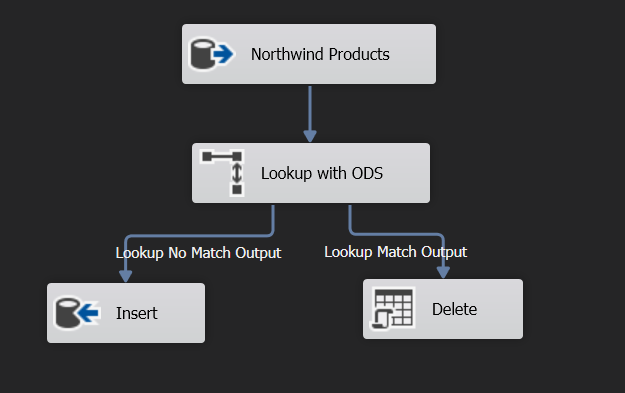

# Northwind BI

Bu proje içerisinde, Northwind veri tabanı kullanılarak baştan sona iş zekası süreçlerini uygulamak için geliştirilmiştir. Araç seti olarak Microsoftun araçları olan SQL Server, SSIS, SSAS ve Power BI kullanılır.

Üç ana aşamada projeyi tamamlayacağız. İlk olarak Data warehouse ve ODS katmanlarının şemaları oluşturulur, her katmanın oluşturma scriptleri ana dizinde bulunabilir, ikinci adımda bu şemalar kaynak veritabanımızdan ETL süreci ile doldurulur. Son adımda ise veri ambarımıza bağladığımız SSAS ve ona bağladığımız Power BI araçlarımız ile rapor oluşturulur. Adım adım projenin geliştirilme aşamaları aşağıda yer almaktadır.


<p align="center">
  <a href="https://www.youtube.com/watch?v=W84oOC8XDuM">
    
  </a>
</p>


# Süreç


## Northiwnd veritabanı oluşturulur.

Northwind sektörde çok sık kullanılan bir örnek veritabanı olduğu için ve şemalarıda görece basit olduğu için tercih edildi. Ancak DW geliştirmek için ETL sürecimizde kullanacağımız CDC (Incremental Load) sürecimiz için her tabloya `ModifiedDate` alanı eklendi ve tablo üzerinde yapılan güncelleme işlemlerinde bu alanı güncelleyecek triggerlar oluşturuldu. 

<details>
  <summary>CDC nedir? </summary>
  
Bir örnek üzerinden anlatacak olursak ETL paketleri genel olarak her gece 00:00 da çalıştırılır ve o güne ait verileri DW içerisine aktarır. Order tablosu gibi transaction barındıran tablolarda veri adeti aşırı büyüklüklere ulaşabileceği için DW üzerinde tüm verileri TRUNCATE et daha sonra tüm verileri tekrar aktar gibi bir mantık yürütemeyiz. Bunun yerine sadece o gün eklenen, güncellenen ve silinen satırlar işleme alınmalıdır. Bunun için SQL Server kendi CDC çözümünü barındırsada biz geliştirici olarak kendi logic'iğimizi implemente edebiliriz. Bunun için tarif ettiğim gibi `ModifiedDate` alanı eklenir, bu alan güncellemelerde güncellenecek şekilde trigger ile tetiklenir, daha sonra ilk hedefimiz olacak olan ODS (Operational Data Store) katmanındaki en güncel veriden sonraki veriler Northwind katmanından çekilerek çok daha performanslı bir süreç işletilir. Bu tarif edilen `ModifiedDate` güncellemesi aşağıdaki gibi yapılabilir.
</details>

<br/>

```sql
ALTER TABLE Products
ADD "ModifiedDate" DateTime NOT NULL DEFAULT GETDATE()
GO

CREATE TRIGGER ProductsAfterUpdateSetModifiedDate ON Products
   FOR UPDATE
   AS
   BEGIN
      UPDATE Products
      SET dbo.Products.ModifiedDate = GETDATE()
      FROM inserted
      WHERE Products.ProductID = inserted.ProductID
   END
GO
```

Ek olarak Primary key içermeyen Order Details ve Employee Territories tablolarına PK ekliyoruz çünkü PK olmadan silme ve güncellemede sıkıntı çekiyoruz.


## NorthwindODS veritabanı oluşturulur.

<details>
  <summary>ODS katmanı nedir? </summary>
  
ODS katmanımız üzerinde kaynak veritabanı üzerinden çekilen veriler DW üzerine aktarılmadan önce tutulduğu operasyonel katmandır. Bu katmana analiz işlemlerinde kullanılmayacak sutünlar alınmayabilir fakat mümkün olan en çok şekilde kaynak veritabanının şemasına benzemelidir. 
</details>

<br/>

NorthwindODS veritabanı, Olası NorthwindDW veritabanının olası şeması dikkate alınarak Northwind kaynak veritabanımıza mümkün olan en benzer şekilde oluşturuldu. 


## Northwind to NorthwindODS için SSIS paketi oluşturulur.

<details>
  <summary>ETL nedir? </summary>
  
Veriler farklı sebeplerle sürekli olarak yer değiştirebilir. Bu aktarım süreçlerinede ETL (Extract Transform Load) deniliyor. Biz bu örnekte Source'dan ODS'ye, ODS'den DW'ye aktarım yapıyoruz. 
</details>

<br/>


<details>
  <summary>SSIS nedir? </summary>
  
SSIS, Microsoft tarafından geliştirilen ETL aracıdır, yüksek performansta çalışabilir fakat Big Data için uygun bir araç olmayabilir.
</details>

<br/>

Veritabanları oluşturulduktan sonra Northwind kaynak veritabanımızdaki veriler NorthwindODS katmanımıza ETL sürecimiz ile CDC dikkate alınarak taşınır. Bu projelere ./NorthwindBI içerisinden ulaşabilirsiniz.

Ekleme ve güncelleme için ilk Product tablomuzu örnek olarak ele alırsak aşağıdaki script ile veriler Northwind kaynağından NorthwindODS kaynağındaki `MAX(ModifiedDate)` değerinden büyük olanları getirerek yapılır. Bu şekilde getirilen verini PK değeri eğer ODS katmanında yoksa veri insert edilir, eğer varsa update gelmiştir update edilir. Bu varlığın kontrolü ise Lookup komponenti ile yapılır. `WITH (NOLOCK)` sorgulara performans katar fakat veri tutarlılığından feragat eder.

```sql

DECLARE @LatestDate DATETIME

SELECT @LatestDate = (SELECT MAX(ModifiedDate) FROM NorthwindODS.dbo.[Products] WITH (NOLOCK))

IF @LatestDate IS NOT NULL
	SELECT *
	FROM [Northwind].[dbo].[Products] WITH (NOLOCK)
	WHERE ModifiedDate > @LatestDate
ELSE
	SELECT *
	FROM [Northwind].[dbo].[Products] WITH (NOLOCK)

```

Insert & Update Example




## NorthwindDW oluşturulur

<details>
  <summary>DW Nedir?</summary>
  
Data warehouse yani veri ambarı bir çok farklı probleme çözüm olarak kullanılır:

- Analiz soruglarımız OLTP sistemlerinde yürütürsek bu sistemlere aşırı yük bindirir ve çökmelere sebep olabiliriz.
- Geçmişe dönük verileri kaybetmeden tutabilir, bunlarla analiz yapabiliriz. 
- Tek bir doğruluk kaynağı oluştururuz. Şirketler CRM, mobil uygulamalar ve benzeri bir çok çeşitli kaynakla sürekli olarak veri oluştururlar, bu verileri tek bir kaynakta tutarlı olarak tutmayı sağlar. 
</details>

<br/>

<details>
  <summary>OLTP Nedir?</summary>

OLTP yani Online transaction processing sistemleri örneğin bir SaaS uygulamasının kullandığı veritabanları için kullanılır. Analiz çalışmaları için değil, sistemin doğru ve hızlı bir şekilde çalışması için kullanılır.
</details>

<br/>

<details>
  <summary>OLAP Nedir?</summary>

OLAP yani Online analytical processing ise üzerinde aggregation, gruplama, analiz yapacağımız verileri tuttuğumuz sistemlerdir. 
</details>

<br/>

<details>
  <summary>SCD Nedir?</summary>
  
SCD, veri ambarlarında geçmişe yönelik veriyi Dimension boyutunda kaybetmemek için kullanılır. Fact tablolarında geçmişe ait verileri Snapshot tablolarında tutabiliriz. Dimension tablolarında SCD birden çok tipte uygulanabilir. Biz burada Type 2 yani yeni bir satır ekleme yaparak kullandık. Bu yöntem ile yeni bir veri geldiğinde insert edilir, geçmiş verilerin `Status` alanı 0 yapılır.
</details>

<br/>

DW şemamız için Dimensional şema kullanıldı ve kaynaktaki tek transcation order yapımız olduğu için sadece bir adet Fact oluşturuldu (Fact.Orders). Diğer tablolar bu tablo etrafında snowfleake şema oluşturacak şekilde yerleştirildi.

Calculated bir tablo olan Dim.Date tablosundaki verileri oluşturmak için TSQL ile döngüler vs. kullanarak order tablosundaki en küçük ve en büyük yıl aralığını kapsayacak şekilde oluşturuldu.

```sql

/**** Dim.Date veri ekleme ****/
DECLARE @i int;
DECLARE @MinDateFromDB int;
DECLARE @MaxDateFromDB int;
DECLARE @MinDate date;
DECLARE @MaxDate date;
DECLARE @Date date;
-- For Insert
DECLARE @DateKey int;
DECLARE @FullDateKey date;
DECLARE @DayNumberOfWeek int;
DECLARE @DayNumberOfMonth int;
DECLARE @DayNumberOfYear int;
DECLARE @MonthNumber int;
DECLARE @YearNumber int;

-- Minimum va Maximum date'ler çekilir.
SET @MaxDateFromDB = (SELECT (DATEPART(YEAR, max(RequiredDate)) + 1) FROM Northwind.dbo.Orders)
SET @MinDateFromDB = (SELECT (DATEPART(YEAR, min(OrderDate)) - 1) FROM Northwind.dbo.Orders)

-- MaxDate ile MinDate arasındaki farkın günü alınır. +- 1 ile hesaplanır. Artık yıl +1 ile hesaplanmıştır.
SET @i = ((@MaxDateFromDB - @MinDateFromDB) * 365) + 1

-- Base date oluşturulur, üzerinden işlem yapılacak.
SET @MinDate = DATEFROMPARTS(@MinDateFromDB, 1, 1)

WHILE @i > 0
BEGIN
	SET @DateKey = convert(int, replace(convert(varchar(20), @MinDate), '-',''));
	SET @FullDateKey = @MinDate;
	SET @DayNumberOfWeek = DATEPART(WEEKDAY, @MinDate);
	SET @DayNumberOfMonth = DATEPART(DAY, @MinDate);
	SET @DayNumberOfYear = DATEPART(DAYOFYEAR, @MinDate);
	SET @MonthNumber = DATEPART(MONTH, @MinDate);
	SET @YearNumber = DATEPART(YEAR, @MinDate);

	INSERT INTO NorthwindDW.Dim.Date
           (DateKey
           ,FullDateKey
           ,DayNumberOfMonth
           ,DayNumberOfWeek
           ,DayNumberOfYear
           ,MonthNumber
           ,YearNumber)
     VALUES
           (@DateKey
           ,@FullDateKey
           ,@DayNumberOfMonth
           ,@DayNumberOfWeek
           ,@DayNumberOfYear
           ,@MonthNumber
           ,@YearNumber)
		

	SET @MinDate = DATEADD(DAY, 1, @MinDate)
    SET @i = @i - 1
END

```

SCD yapımızı ele almak için Dim tablolarına `StartDate`, `EndDate` ve `Status` sutünları eklenir.


## NorthwindODS to NorthwindDW için SSIS paketi oluşturulur.

Bu pakette diğer paketten farklı olarak Products tablomuz için SCD uygulandı. SCD aşamaları olarak aşağıdaki açıklamalar takip edilir.

- Insert

Yeni eklenen veriler ilk önce ODS katmanına yazılır, ODS katmanından DW katmanına `UpdatedDate` ve DW katmanındaki `StartDate` alanlarında göre CDC uygulanarak alınır.

- Update

Güncel veriler için ilk olarak verinin güncel hali için yeni bir insert yapılır, bu eklenen kayıtta `StartDate`, bir önceki kayıttaki `EndDate`, ODS katmanındaki `ModifiedDate` ile eşleştirilir. Eski kayıt için status 0 yapılır, yeni kayıtta status 1 olur, varsayılandır.

| ProductKey | ProductAlternateKey | UnitPrice | StartDate               | EndDate                 | Status |
| ---------- | ------------------- | --------- | ----------------------- | ----------------------- | ------ |
| 1          | 21                  | 2         | 2022-07-26 10:26:00.000 | 2022-07-26 10:30:00.000 | 0      |
| 2          | 21                  | 5         | 2022-07-26 10:30:00.000 | 2022-07-26 10:50:00.000 | 0      |
| 3          | 21                  | 10        | 2022-07-26 10:50:00.000 | 9999-12-30 23:59:00.000 | 1      |

- Delete

Silinme tarihi tutulmadığı için, silinme durumunda `EndDate` alanı `GETDATE()` ile doldurulur, status 0 yapılır.

| ProductKey | ProductAlternateKey | UnitPrice | StartDate               | EndDate                 | Status |
| ---------- | ------------------- | --------- | ----------------------- | ----------------------- | ------ |
| 1          | 21                  | 5         | 2022-07-26 10:26:00.000 | 2022-07-26 10:30:00.000 | 0      |
| 2          | 21                  | 10        | 2022-07-26 10:30:00.000 | 2022-07-26 10:45:00.000 | 0      |


SCD dışında Fact.Orders tablomuzuda Northwind kaynağımızdaki Orders, Order Details tabloları ile besleriz. Bu iki tablo joinlenir, ship bilgileri text bilgi olduğu için kural gereği Fact tablolarında bulunmaz, bu sebeple ayrı bir tabloya taşındı. Tarih bilgilerinide Dim.Date tablosundan getiriyoruz.

## NorthwindDW, SSAS üzerine aktarılır

SSAS Tabular Model üzerinde DAX sorguları ile anlamlı ölçüler oluşturulur. SSAS aynı zamanda direk olarak Power BI üzerine aktarma yapmaya göre çok daha performanslı çalışır. Bazı örnek ölçüler aşağıdaki gibidir. Bu oluşturduğumuz ölçüler ile son aşamaya geçecek ve Power BI raporu oluşturacağız.

```DAX

Total profit:=  SUMX(Orders, ( Orders[UnitPrice] * Orders[Quantity] ) - ( Orders[Discount] * Orders[UnitPrice] * Orders[Quantity] ) - Orders[Freight])

Count of products:= CALCULATE(DISTINCTCOUNT(Products[ProductKey]), Products[Status] == True)

```

## Power BI raporu oluşturulur.

Tüm süreç boyunca oluşturduğumuz ve anlamlandırdığımız yapıları kullanarak son aşamamız olan Power BI üzerinden anlamlı veri özetleri ve veri analizleri oluştururuz. Burada amaç Northwind şirketini yöneten kişilere şirketin gidişatı hakkında bilgi vermek, geçmiş verileri üzerinden analizler sunarak geleceğe bakış sağlamaktır.
